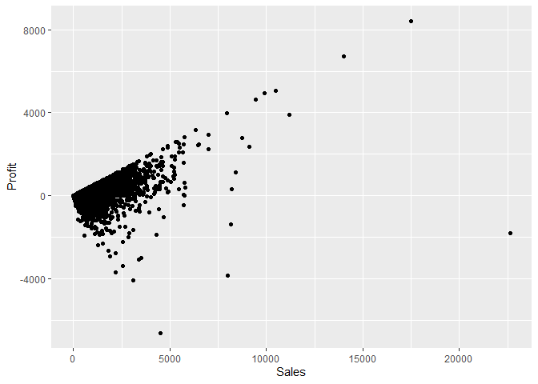
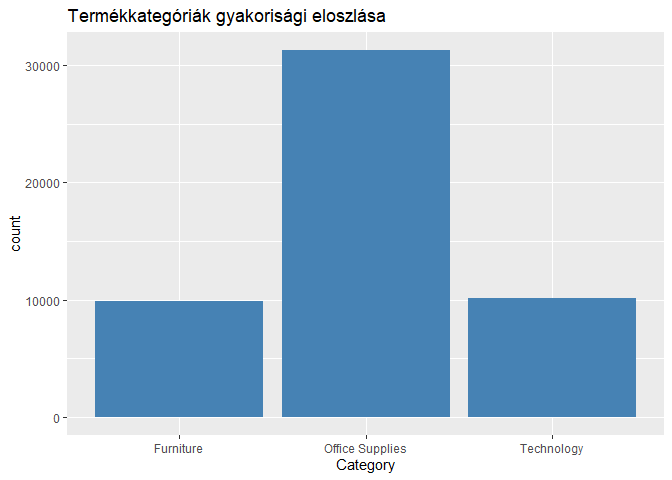
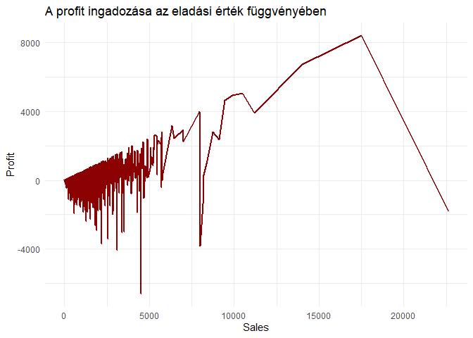
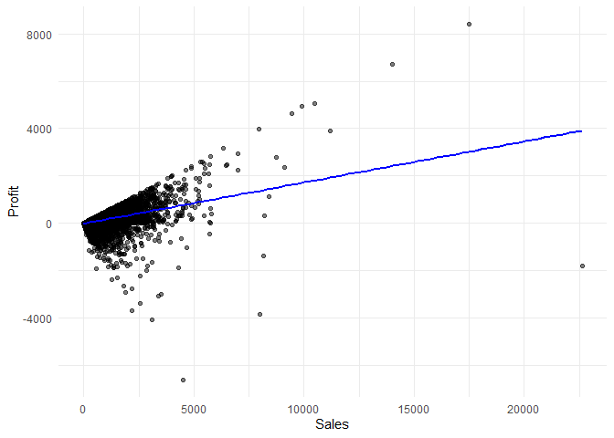

Superstore_elemzes
================
Barnai_Balazs
2026-03-15

## R Markdown

``` r
ggplot(data = superstore,aes(x=Sales,y=Profit)) +
  geom_point()
```

<!-- -->

``` r
ggplot(data=superstore,aes(x=Category)) +
  geom_bar(fill="steelblue")
```

<!-- -->

``` r
ggplot(data=superstore,aes(x=Sales,y=Profit)) +
  geom_line(color="darkred",size=1)+
  theme_minimal()
```

    ## Warning: Using `size` aesthetic for lines was deprecated in ggplot2 3.4.0.
    ## ℹ Please use `linewidth` instead.
    ## This warning is displayed once every 8 hours.
    ## Call `lifecycle::last_lifecycle_warnings()` to see where this warning was
    ## generated.

<!-- -->

``` r
ggplot(data = superstore,aes(x=Sales,y=Profit)) +
  geom_point(alpha = 0.5) +
  geom_smooth(method = "lm", color = "blue", fill = "lightblue") +
  theme_minimal()
```

    ## `geom_smooth()` using formula = 'y ~ x'

<!-- -->
